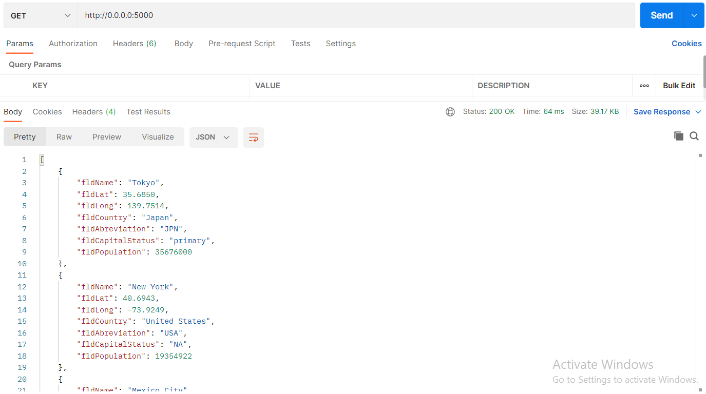
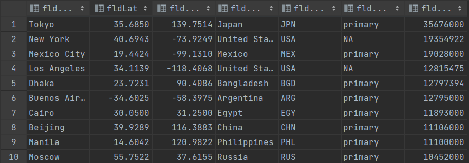

# Project Description
This project is a homework assignment to teach how to get Pycharm setup with Docker, Flask, MySQL

## Project Steps

1. Create a new project with PyCharm
2. Create the files and folder in the root directory of the project (.gitignore, app, db, screenshots, docker-compose.yml, README.MD)
3. Texts and code added to the respective files and folder.
4. Created an "init.sql" file wthin the "db" directory of the project and added the contents to it.
5. Run the project and view the results in postman.

# Postman Screenshot

#SQL Data Screenshot

